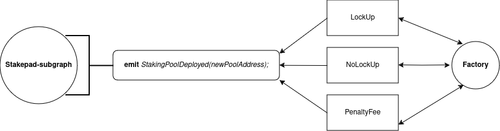
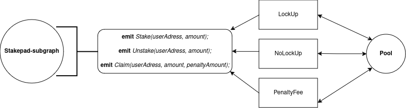

# Stakepad-subgraph Specification

This document provides a detailed specification for the Stakepad subgraph, outlining the essential information about the project to build a comprehensive understanding of the codebase.

## Contents

- [Introduction](#introduction)
  - [Subgraph](#subgraph)
  - [Token Types](#token-types)
    - [ERC20](#erc20)
    - [ERC721](#kip7)
  - [Pool](#pool)
  - [Factory](#factory)
  - [Utility](#utility)
  - [Architecture](#architecture)


## Introduction
The stakepad-subgraph provide a detailed overview of the indexer, handlers and entities used to index data from smart contracts.

## Subgraph
The stakepad-subgraph consist of 2 main components: 
* Pool handlers which index data from `staking pool contracts`
* Factory handler which index data from `staking factory contracts`

## Token Types
Dex protocol works with ERC20 and KIP7 token standards that implement APIs for fungible tokens within smart contracts.

## ERC20
ERC20 is a token standard for Fungible tokens that is used in pools which indexed in the subgraph

## ERC721
ERC721 is a token standard for Non-fungible tokens that is used in pools which indexed in the subgraph

## Pool
Subgraph indexes different type of pools such as LockUp, NoLockUp, PenaltyFee

The `pool.ts` mapping file handles the following events emitted in smart contracts:
* Stake Event - index the data emitted after staking some tokens in the pool.
* Unstake Event - index the data emitted after unstaking some tokens in the pool.
* Claim Event - index the data emitted after claiming some tokens in the pool.
* Update Pool Event - index the data emitted in each events mentioned above to update parameters in the pool.


```ts
export function handleStake(event: StakeEvent): void {}

export function handleUnstake(event: UnstakeEvent): void {}

export function handleClaim(event: ClaimEvent): void {}

export function handleUpdatePool(event: PoolUpdateEvent): void {}
```

## Factory
Subgraph Factory also indexes different type of factories such as LockUp, NoLockUp, PenalteFee through one common event:
* StakingPoolDeployedEvent - index the data emitter after sending request to create a new staking pool with specific parameters

The `factory.ts` mapping file handles the only one event emitted in factory smart contracts for all type of factories:
```ts
export function handleStakingPoolDeployed(event: StakingPoolDeployedEvent): void {}
```

## Utility
Besides the mapping files, the subraph has utility files `user.ts`, `token.ts`, `factory.ts` to either create or load/fetch data about user, token and factory correspondingly. We can call it internal API functions, Here is the overview:
```ts
// subgraphs/staking/src/utils/factory.ts
export function getOrCreateFactory(factoryAddress: Address): Factory {}

// subgraphs/staking/src/utils/token.ts
export function fetchToken(tokenAddress: Address): Token {}

// subgraphs/staking/src/utils/user.ts
export function getOrCreateUser(poolAddress: Address, address: Address): User {}
```

## Architecture
Factory:


Pool:
